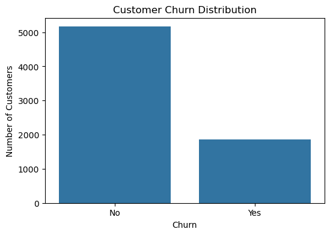
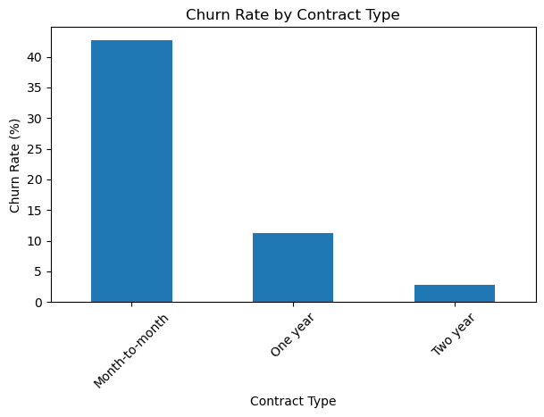
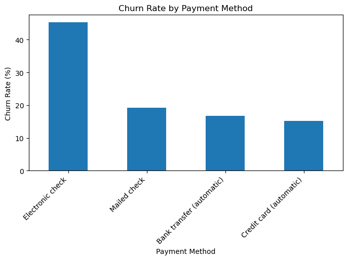
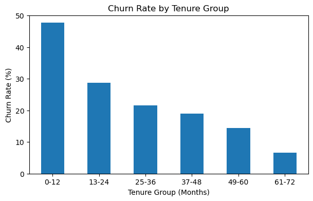
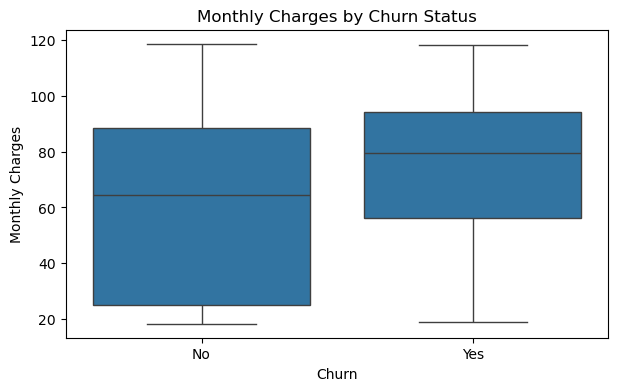

# Customer Churn Analysis — Python Data Analysis Project

## Overview

This project analyzes customer churn data from a telecom company to identify key factors related to customer cancellation behavior.

The goal of this project is to explore customer characteristics, service usage, contract type, payment method, tenure, and monthly charges in order to generate business insights that can support customer retention strategies.

## Dataset

The dataset contains customer information from a telecom company, including demographic information, account details, subscribed services, and churn status.

Main columns include:

- Customer ID
- Gender
- Senior Citizen
- Partner
- Dependents
- Tenure
- Phone Service
- Internet Service
- Contract
- Payment Method
- Monthly Charges
- Total Charges
- Churn

Dataset source: Telco Customer Churn Dataset on Kaggle

## Tools Used

- Python
- Pandas
- NumPy
- Matplotlib
- Seaborn
- Jupyter Notebook

## Project Workflow

1. Project Overview
2. Dataset Description
3. Load Dataset
4. Data Understanding
5. Data Cleaning
6. Churn Overview KPIs
7. Churn Distribution
8. Churn by Contract Type
9. Churn by Payment Method
10. Churn by Internet Service
11. Tenure Analysis
12. Monthly Charges vs Churn
13. Total Charges vs Churn
14. Key Insights
15. Business Recommendations

## Analysis Performed

### Data Cleaning

- Converted the `TotalCharges` column from object type to numeric.
- Handled missing values after type conversion.
- Checked duplicate records.

### Churn Overview KPIs

Calculated the main churn-related KPIs:

- Total Customers
- Churned Customers
- Retained Customers
- Churn Rate

### Churn Distribution

Analyzed the overall distribution of churned and retained customers.

### Churn by Contract Type

Compared churn rates across different contract types to understand how contract length relates to customer churn.

### Churn by Payment Method

Analyzed churn rates across payment methods to identify payment-related churn patterns.

### Churn by Internet Service

Compared churn behavior across internet service types.

### Tenure Analysis

Grouped customers by tenure range and analyzed churn behavior across different customer lifetime groups.

### Monthly Charges vs Churn

Compared monthly charges between churned and retained customers.

### Total Charges vs Churn

Compared total charges between churned and retained customers.

## Visualizations

### Churn Distribution

### Churn Rate by Contract Type

### Churn Rate by Payment Method

### Churn Rate by Tenure Group

### Monthly Charges by Churn Status

## Key Insights

- Customers with month-to-month contracts showed the highest churn rate.
- Customers with shorter tenure were more likely to churn.
- Electronic check users had a higher churn rate compared to other payment methods.
- Customers using fiber optic internet showed higher churn compared to other internet service types.
- Higher monthly charges appeared to be associated with increased churn risk.

## Business Recommendations

- Offer loyalty discounts or contract incentives to month-to-month customers.
- Focus retention campaigns on customers within their first 12 months.
- Investigate customer experience issues among fiber optic users.
- Encourage high-risk customers to switch from electronic check to more stable payment methods.
- Monitor customers with high monthly charges and provide targeted offers or service improvements.

## Project Files

- `README.md`: Project documentation, including overview, workflow, insights, recommendations, and visualizations.
- `customer_churn_analysis.ipynb`: Main Jupyter Notebook containing data cleaning, exploratory data analysis, charts, insights, and business recommendations.
- `data/WA_Fn-UseC_-Telco-Customer-Churn.csv`: Dataset used for the customer churn analysis.
- `assets/charts/churn_distribution.png`: Chart showing the overall churn distribution.
- `assets/charts/churn_by_contract_type.png`: Chart showing churn rate by contract type.
- `assets/charts/churn_by_payment_method.png`: Chart showing churn rate by payment method.
- `assets/charts/churn_by_tenure_group.png`: Chart showing churn rate by tenure group.
- `assets/charts/monthly_charges_by_churn.png`: Chart comparing monthly charges by churn status.
